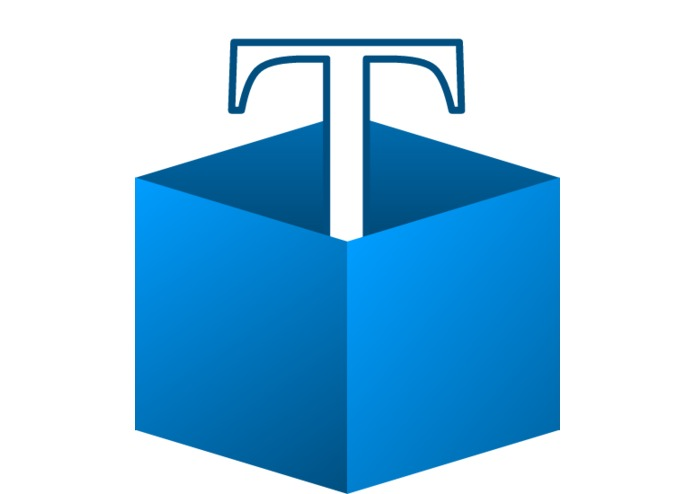
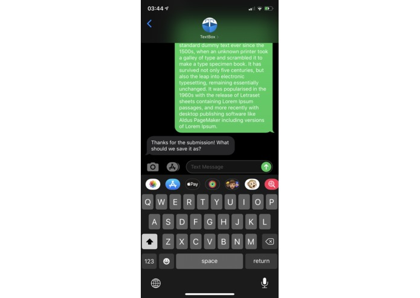
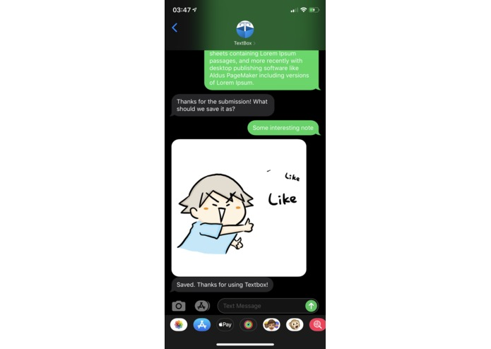
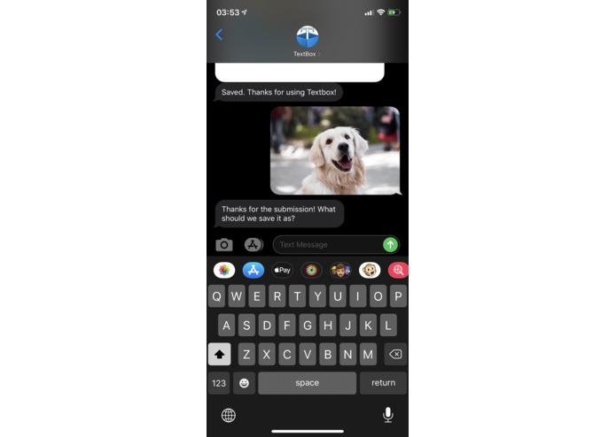
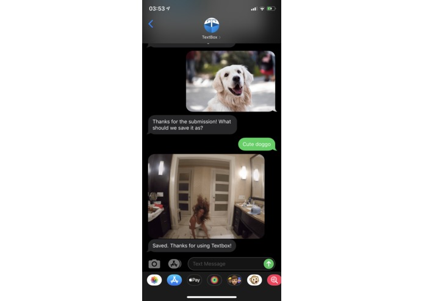
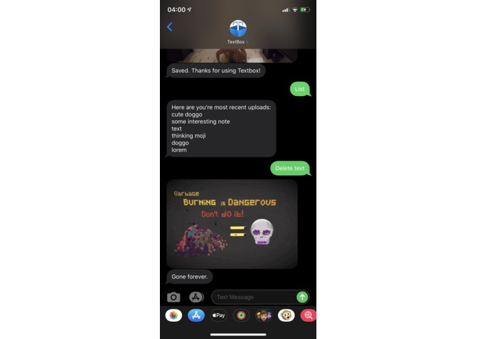
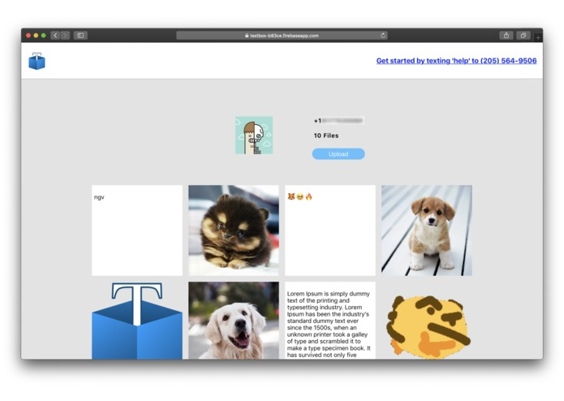

This project was completed within 24 hours by a team of 4 at <strong>HackNY Fall 2019</strong> by Andrey Shtukenberg, David Margolin, Deren Lin and Xin Yuan. It was awarded <strong>The Most Technical</strong> project.

<strong>TextBox</strong> is a cross platform service that allows users to save and access text/media on any of their devices with or without a network connection.

<strong>Why TextBox?</strong> 
For those times when our phones are <strong>low on storage</strong> or when we’re having a hard time accessing our photos/docs because the <strong>internet sucks</strong>.
 TextBox is super light weight. Actually <strong>NO WEIGHT</strong> at all. Just text!

<strong>How to Use?</strong>
- Send your text/media to <strong>(205)564-9506</strong>. We'll ask you to name it and take care of the rest. 
- Enter "find" and the name of your item to get it back. 
- Enter "delete" and the name to delete the item. 
- Enter "list" to get a list of recently saved items. 
- Enter "help" to get more useful infomation.
 (We support images, gifs, videos, and text)

Oh and there's an amazing web interface that lets you do all of these things too. It's live at https://neverrunoutof.space
 So whether you're on your phone, your laptop, with internet or without, use TextBox to manage your storage.

Our backend is written in <strong>Nodejs</strong>, the frontend in <strong>React</strong>. We use <strong>Twilio</strong> to send messages, <strong>Google Cloud</strong> to manage storage and host our frontend, <strong>Mongodb Atlas</strong> for fast search, and <strong>Giphy</strong> to tie everything together. 
    <strong>Go check it out!</strong>   

